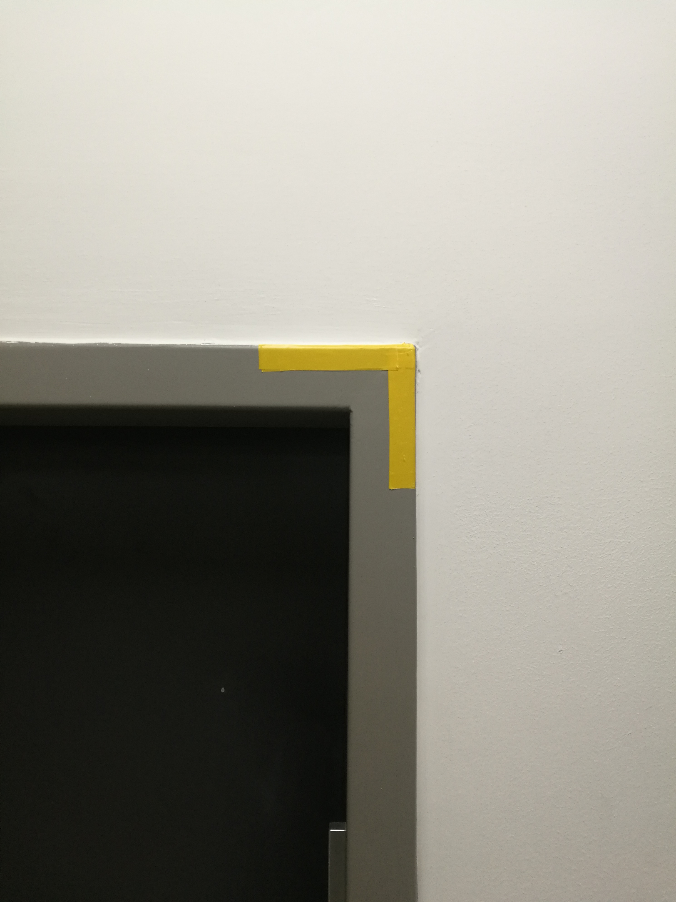
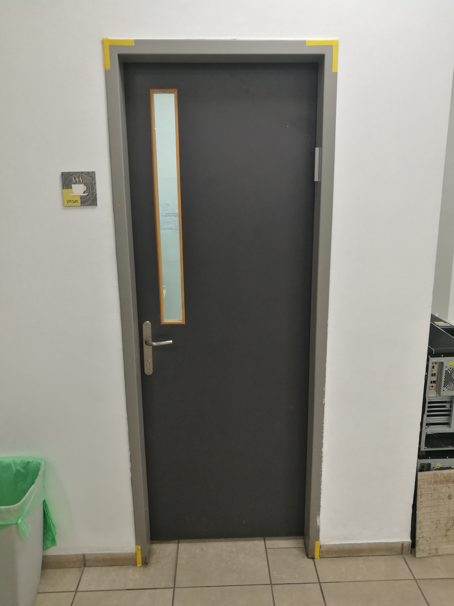
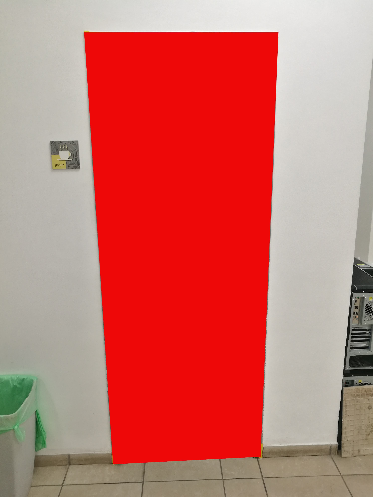
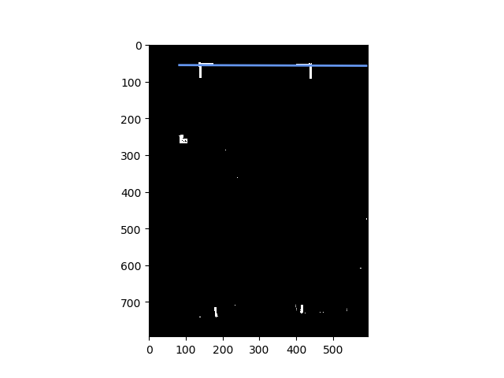

# PROJECT IMPROVEMENTS
During the evaluation of the script, and based on the work conducted by David Peles and his team, several rejects and possible improvements are suggested which may give significant improvements in the final result.

In order to use the algorithm for a successful indoor navigation, the segmantation results have to be consistent. 

## Database increase

A method to increase the database size is suggested:

For the specific indoor environment where the drone will be operating, the database of images containing / not containing the doorways & windows will be collected. Since the ground truth is known, an algorithm may be derived which will extract their location using some signs known a-priori.

### Benefits

- This method can be operating online, continuously increasing the dataset
- This will increase significantly the dataset size for this specific region where the learning will take place

### Disadvantages 

- The solution will be location - specific

### Implementation methods

In order to derive the ground-truth, we use the computer-vision methods of detecting specific objects in the scene. We attach the color-based patches onto the doorways and windows, and then use methods to extract those from the image.

Below is the example:

One of the way to extract the location from the door from this image is using the traditional methods. Although, also here different techniques may be used:

1. Find the colorful small lines of the required color. Use some method to estimate the door lines. Color the shape inside. Analyze the shape, if this shape is a parallelogram, then the prediction is correct

    Possible improvement - use the tracking algorithm to track the shapes in the corners. 

    Implementation: 
    - the color of those segments is known apriori. Image analisys will be in the LAB color space, in order to decrease the lightness influence on the result.
    - Lines extraction (methods) : 
        - use RANSAC to find the lines in the image
        - Use the Hough transform

## Ideas 

We can later use the Harris Corner Detector to verify that the 4 edge-points of the door are indeed 'corners' (they should be detected by the Harris Corner Detector!). If they are, we can describe those corners as 'Features' (SIFT) and track those between the images. 

#### Using the RANSAC

Below is the example the image with the RANSAC algorithm detecting a single line. But this method will not be used. (Using the _sklearn_ library)

 

## Results

The following is the description of the process which currently works and identifies doorways.

### 1. The input image

### 2-3. Extract the Mask, clean it

Extract the mask of the colorful markers using the HSV color spectrum. \
Then use Morphological Open operator to clean the noise

### 4-5. Find Edges on original image, draw Hough Lines

Use the Canny Edge detector

### 6-7. Find Edges on mask image, draw Hough Lines

### 8-9 Filter Hough Lines from mask with Hough Lines from normal image. Use non-max suppression to unite similar lines

### 10-11 We expect to receive 4 lines. Find intersections, draw the polygon inside

## Discussion:

We can see that in this specific presented example we have obtained a good doorway recognition. By using numerous images, I have reached 50% success in recognizing the doorway. 

The following constraints apply to this algorithm:

1. Only 1 'bordered' object may be present in the scene
2. All 4 markers must be fully visible
3. The object has to have visible edges which will be detected using normal Hough transform

The following can be done to improve performance:

1. Use longer markers
2. Use color which is rare in the scene
3. Tune the algorithm parameters
