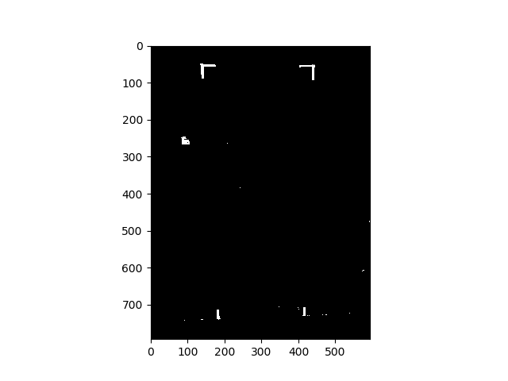

# PROJECT IMPROVEMENTS
During the evaluation of the script, and based on the work conducted by David Peles and his team, several rejects and possible improvements are suggested which may give significant improvements in the final result.

In order to use the algorithm for a successful indoor navigation, the segmantation results have to be consistent. 

## Database increase

A method to increase the database size is suggested:

For the specific indoor environment where the drone will be operating, the database of images containing / not containing the doorways & windows will be collected. Since the ground truth is known, an algorithm may be derived which will extract their location using some signs known a-priori.

### Benefits

- This method can be operating online, continuously increasing the dataset
- This will increase significantly the dataset size for this specific region where the learning will take place

### Disadvantages 

- The solution will be location - specific

### Implementation methods

In order to derive the ground-truth, we use the computer-vision methods of detecting specific objects in the scene. We attach the color-based patches onto the doorways and windows, and then use methods to extract those from the image.

Below is the example:

One of the way to extract the location from the door from this image is using the traditional methods. Although, also here different techniques may be used:

1. Find the colorful small lines of the required color. Use some method to estimate the door lines. Color the shape inside. Analyze the shape, if this shape is a parallelogram, then the prediction is correct

    Possible improvement - use the tracking algorithm to track the shapes in the corners. 

    Implementation: 
    - the color of those segments is known apriori. Image analisys will be in the LAB color space, in order to decrease the lightness influence on the result.
    - Lines extraction : 
        - use RANSAC to find the lines in the image
        - Use the Hough transform

### Preliminary results

The following is the example of using the filter on the specific HSV parameters. Certain margin values have been tried, until this result was obtained:

Later, we can use the RANSAC method in order to extract the line segments in the image, and use the Maximum suppression in order to leave only the most-outer lines. 
We have to receive at most 3 lines! The line on the bottom will be closing the parallelogram. 

We can later use the Harris Corner Detector to verify that the 4 edge-points of the door are indeed 'corners' (they should be detected by the Harris Corner Detector!). If they are, we can describe those corners as 'Features' (SIFT) and track those between the images. 

Below is the example the image with the RANSAC algorithm detecting a single line. (Using the _sklearn_ library)

 

